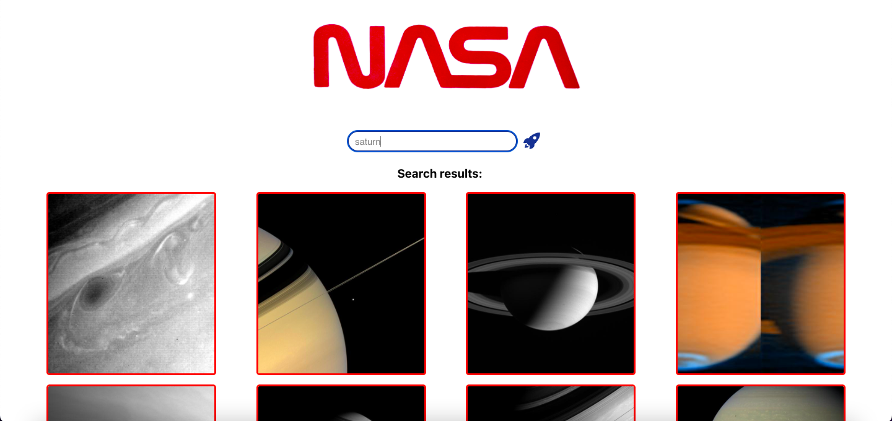
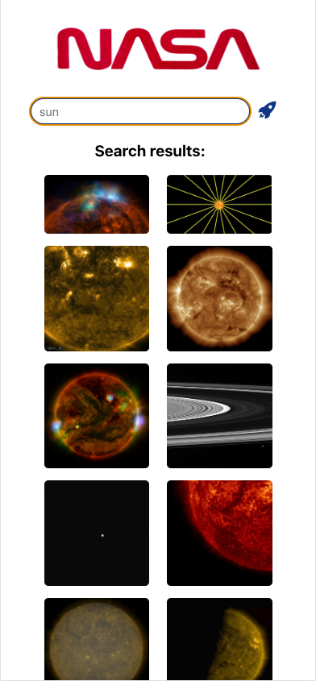

# NASA Image Search Engine App - Tech Test

A NASA search engine that takes user input and returns images from API.

Hosted [here](https://benjQuinn.github.io/React-Tech-Test) on GitHub Pages.

## The Brief

You are expected to build a React web application that allows users to search for images based on a query relating to space. You are provided the NASA API endpoint for image search.
We want you to consider and add anything to your repository that should be included was this to be a live website.

The following functionalities need to be implemented:
- A Search page which allows users to search for images by keyword
- Images must be returned upon a successful search

Relevant API endpoints:

image search:
GET​​ ​​https://images-api.nasa.gov/search ​Params: ​​q

### Technologies: 

- React
- JavaScript
- CSS
- HTML

### Testing Utilities

- Jest
- React Testing Library

### Packages

- Axios
- PropTypes
- ReactIcons

## Media
Desktop:

Mobile:

## Run on your Local Machine

Clone this repository and run:

### `npm start`

Runs the app in the development mode.\
Open [http://localhost:3000](http://localhost:3000) to view it in your browser.

### `npm test`

Launches the test runner in the interactive watch mode.\

### Improvements

- [ ] Add CSS animation (e.g. loading spinners, image animations) to improve UX
- [ ] Show description of image on hover

### Acknowledgements

[Manchester Codes](https://github.com/MCRcodes) Junior Software Developer Bootcamp frontend module project.

### Author

Created by Ben Quinn
